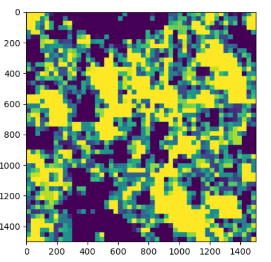
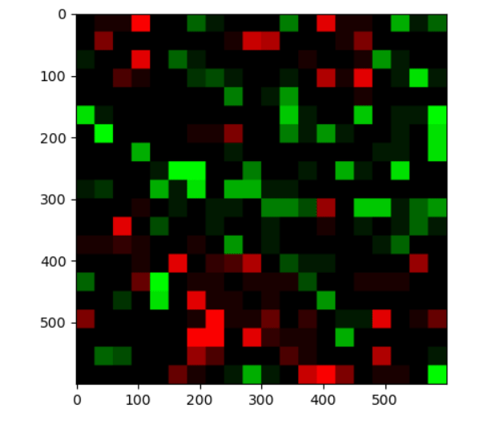
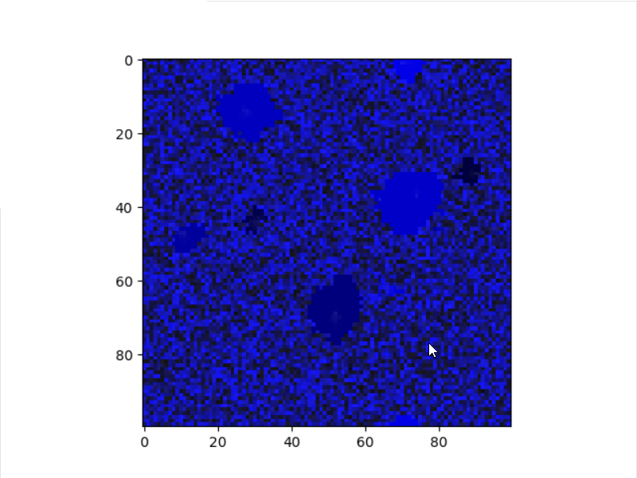

# Wave automata
Me trying to create some cool behaviour and physics in a cellular automaton.
Currently, I haven't put enough brainpower into figuring out good rulesets or even how to define them.

For now, here are some cool patterns from trying to make pixels into factions which fight/eat each other:
## Example gifs
### Mode 0

### Mode 1

### Mode 2
